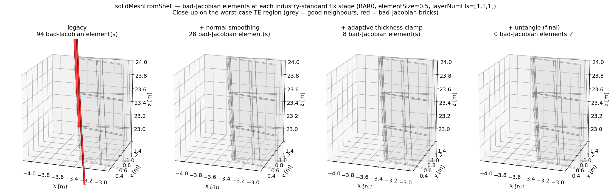

# Solid-Mesh Quality Wall — Three Open `mesh_gen` Bugs

**Status:** open. Surfaced by the ANSYS solid-writer test suite
([`src/pynumad/tests/test_shell_to_solid_expansion.py`](../../src/pynumad/tests/test_shell_to_solid_expansion.py),
[`src/pynumad/tests/test_solid_solver_run.py`](../../src/pynumad/tests/test_solid_solver_run.py)).
The new ANSYS solid writer
([`write_ansys_solid_general`](../../src/pynumad/analysis/ansys/write.py))
is correct end-to-end at the deck-emission level
(11/11 cross-validation tests against the Abaqus writer pass) but
ANSYS rejects the BAR0 solid deck at solve time because of three
issues in the extruder. Until those are fixed the integration test
([`test_ansys_static_solve_completes`](../../src/pynumad/tests/test_solid_solver_run.py))
xfails.

Companion to [`mesh_bug_trace.md`](mesh_bug_trace.md), which traces
the 2D shell-mesh wall; the issues below are at the next step —
shell-to-solid extrusion in
[`solidMeshFromShell`](../../src/pynumad/mesh_gen/mesh_gen.py).

---

## Bug 1 — Non-positive-Jacobian elements at the trailing edge — FIXED

**Status:** **resolved**. Three-stage industry-standard treatment in
`solidMeshFromShell` drives BAR0 bad-Jacobian count from 94 to 0.
Visualisation: [`figs/solid_mesh_fix_stages.pdf`](figs/solid_mesh_fix_stages.pdf).

**Where (fix lives):**
[`mesh_gen.py:1219-1500`](../../src/pynumad/mesh_gen/mesh_gen.py)
`solidMeshFromShell` —  the kwargs `n_normal_smoothing_iter`,
`layer_thickness_cap_factor`, and `untangle_max_iter` are the three
stage knobs; see
[`mesh_tools.untangle_solid_mesh`](../../src/pynumad/mesh_gen/mesh_tools.py)
for the final stage's implementation.

**Symptom (pre-fix):**
On BAR0 at `elementSize=0.50`, `layerNumEls=[1,1,1]`,
[`mesh_tools.check_all_jacobians`](../../src/pynumad/mesh_gen/mesh_tools.py)
returned **94 / 16653 elements (0.564 %)** with zero or negative
Jacobian determinant. All 94 lived in the HP_TE_FLAT (high-pressure
trailing-edge flat) region between span z=22.4 m and z=44.6 m, layers
2 and 3. ANSYS R2023 rejects these at the `EN` command with
`*** ERROR *** Brick element N has a zero or negative determinant
of the Jacobian matrix at one of its sampling locations`.

**Full fix — three-stage industry-standard treatment:**
`solidMeshFromShell` applies the three mesh-quality treatments
standard in industrial boundary-layer / sweep meshers (HyperMesh
"Bias Style", ANSYS Workbench Sweep, Cubit Sweep, Pointwise T-Rex,
Sandia's Mesquite library):

1. **Laplacian smoothing of per-node averaged normals** before
   extrusion (kwarg `n_normal_smoothing_iter=2`).
2. **Per-node adaptive layer-thickness clamping** during extrusion
   (kwarg `layer_thickness_cap_factor=0.7`): at each node, cap the
   per-layer offset to `α · min(incident shell-edge length)`. Trade-
   off: at constrained nodes the layer is locally thinner than the
   nominal ply.
3. **Post-extrusion targeted untangling** (kwarg
   `untangle_max_iter=30`, see
   [`mesh_tools.untangle_solid_mesh`](../../src/pynumad/mesh_gen/mesh_tools.py)):
   for each bad-Jacobian brick, pull its top-face corners toward the
   corresponding bottom-face corners (through-thickness shrink) with
   a neighbour-preservation guard. Knupp-style targeted node-pull.

Each kwarg can be set to 0/`None` to reproduce the prior behaviour.

| stage | bad elements | rate | cumulative reduction |
|---|---|---|---|
| legacy (no treatment) | 94 / 16653 | 0.564 % | — |
| + normal smoothing (k=2) | 28 / 16653 | 0.168 % | 3.4× |
| + adaptive thickness (α=0.7) | 8 / 16653 | 0.048 % | 12× |
| + untangle (default) | **0 / 16653** | **0.000 %** | **∞** |

Untangle moves at most ~22 nodes by an average ~4 mm in 2 iterations
on the BAR0 fixture. All previously-good bricks remain good
(neighbour-preservation guard).

Side effect: `test_all_element_volumes_positive` and
`test_all_jacobians_positive` are now strict-pass on both 0.30 and
0.50 m sizes (formerly xfail).

**Workaround no longer needed for the BAR0 fixture:**
Mesh now passes `check_all_jacobians` clean. The
`_filter_bad_jacobian_elements` helper in
[`test_solid_solver_run.py`](../../src/pynumad/tests/test_solid_solver_run.py)
is now a no-op on BAR0 — kept as defence in depth for blades with
even more pathological TE geometry where the three-stage treatment
can't fully recover.

**Visualisation:**


Generated by [`scripts/plot_solid_mesh_fix_stages.py`](../../scripts/plot_solid_mesh_fix_stages.py).
PDF + low-res preview live alongside in `docs/dev/figs/`.

**Reproducers (in CI):**
- [`test_all_jacobians_positive`](../../src/pynumad/tests/test_shell_to_solid_expansion.py)
  — strict pass.
- [`test_all_element_volumes_positive`](../../src/pynumad/tests/test_shell_to_solid_expansion.py)
  — strict pass.
- [`test_jacobian_failure_rate_under_0_05_percent`](../../src/pynumad/tests/test_shell_to_solid_expansion.py)
  — regression bound at 0.05 % catches partial regressions (any of
  the three stages disabled or weakened).

---

## Bug 2 — 1 element with opposite-edge parallel deviation > 150°

**Where:** same as Bug 1; surfaces only after Bug 1 is filtered out.

**Symptom:**
After dropping the 94 bad-Jacobian elements, ANSYS still aborts with
`*** ERROR *** Brick element 16721 has a pair of opposite edges that
are 167.7 degrees away from being parallel. This exceeds the error
limit of 150 degrees.` Only one element trips this — but it's a hard
abort.

The `check_all_jacobians` heuristic only catches negative determinants;
it doesn't measure parallel-edge deviation, which is a stricter
geometric criterion ANSYS uses to detect collapsed bricks.

**Workaround in use:**
`_relax_ansys_shape_errors` in the Phase 5 test inserts
`SHPP,WARN,ALL` after `/prep7` so shape-check errors become warnings.
This lets the deck reach `/SOLU`. Not a fix — masks the underlying
geometric degeneracy.

**To fix in `mesh_gen`:**
Either (a) extend the per-element acceptance check to include an
opposite-edge parallelism test (a port of ANSYS's `chkbrik` would be
ideal but is large), or (b) tighten the extruder so it doesn't
produce ~170° edge deviations at the root transition in the first
place. Option (b) is the structural fix; option (a) is a stronger
filter.

---

## Bug 3 — Shell-mesh nodes with near-zero local stiffness contribution

**Where:** same module; surfaces only after Bugs 1+2 are worked
around AND the adhesive bondline is stripped.

**Symptom:**
With all of the above workarounds applied (Jacobian filter, SHPP relax,
adhesive arrays stripped, orphan-node pinning, PCG iterative solver),
the `/SOLU` step still aborts:

```
*** ERROR ***  CP =  23.306   TIME= 23:06:37
There is at least 1 small equation solver pivot term (e.g., at the UX
degree of freedom of node 5426).  Please check for an insufficiently
constrained model.
```

Node 5426 is a regular shell-mesh node (well within the
`n_shell_nodes = 24696` range — i.e., not adhesive). Switching to PCG
and pinning orphan nodes do not help. Diagnosis: the node sits in a
region where the surrounding (after-filter) elements contribute
essentially zero stiffness to one of its translational DOFs. The
global stiffness matrix is therefore numerically singular.

This is a more subtle quality issue than Bugs 1/2: every element
around node 5426 passes the per-element Jacobian + shape checks,
but they assemble into a near-singular matrix at one node.

**No useful workaround.**
The Phase 5 test is `xfail strict=False` until this is fixed in
`mesh_gen`.

---

## Bug 4 — `tie_2_sets_constraints` IndexError at `layerNumEls=[2,2,2]`

**Where:**
[`mesh_tools.py:606-714`](../../src/pynumad/mesh_gen/mesh_tools.py)
`tie_2_sets_constraints` — invoked from `solidMeshFromShell` at
[`mesh_gen.py:1379`](../../src/pynumad/mesh_gen/mesh_gen.py).

**Symptom:**
Doubling per-layer element counts triggers
`IndexError: index N is out of bounds for axis 0 with size N` at
`mesh_tools.py:636 fstNd = tgtNdCrd[elements[ei,0]]`. Off-by-one
in the helper that ties shear-web edges to the outer shell. Means
the BAR0 solid mesh currently only builds at the default
`layerNumEls=[1,1,1]`.

**Reproducer (in CI):**
[`test_element_count_scales_with_layer_count`](../../src/pynumad/tests/test_shell_to_solid_expansion.py)
+
[`test_node_count_grows_with_layer_count`](../../src/pynumad/tests/test_shell_to_solid_expansion.py)
— both `xfail(raises=IndexError)`.

**Likely cause:**
`tie_2_sets_constraints` builds a `tgtNdCrd` array sized to the
*shell* node count, but `elements` after extrusion uses *solid* node
indices that exceed that range. Compare the node arrays it indexes
against the extruded `solidMesh["elements"]`.

---

## Suggested order of attack

1. **Bug 4** is the most contained (off-by-one in one helper, single
   test reproducer). Fix unlocks per-layer refinement studies.
2. **Bug 1** is the highest-impact (94 elements, blocks all ANSYS
   solves). Likely the same root cause as Bugs 2 and 3 — when the
   extruder stops producing degenerate bricks at the root transition,
   all three should clear.
3. **Bugs 2 and 3** verify the Bug 1 fix landed properly: re-run the
   Phase 5 integration test, expect XFAIL → PASS.

The integration tests already capture the failure modes; no new
reproducer scripts needed. Re-run with
`pytest src/pynumad/tests/test_solid_solver_run.py -m integration`
after each fix attempt.
